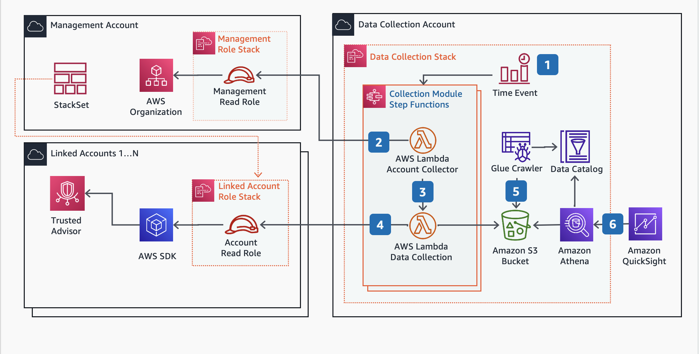

# AWS Cloud Intelligence Dashboards


## Description

**Problem**: Organizations struggle with AWS cost visibility and optimization across multi-account environments. Manual cost analysis is time-consuming, lacks standardization, and fails to provide actionable insights into spending patterns, resource utilization, and optimization opportunities.

**Solution**: This Terraform module automates the deployment of AWS Cloud Intelligence Dashboards (CID) framework across your AWS Organization. It provisions a complete cost intelligence platform using AWS QuickSight, delivering pre-built dashboards that transform raw billing data into actionable insights for cost optimization, chargeback/showback, and resource rightsizing.

**Architecture Overview**: The module operates across two AWS accounts using a hub-and-spoke architecture:
- **Source (Management Account)**: Deploys data collection modules via CloudFormation StackSets, gathering cost, usage, and operational data from across your organization
- **Destination (Cost Analysis Account)**: Provisions QuickSight dashboards, Athena views, S3 storage, and data collection orchestration

The framework integrates with AWS Cost and Usage Reports (CUR 2.0), AWS Data Exports, and various AWS services to collect metrics on backups, budgets, compute optimizer recommendations, ECS workloads, health events, inventory, RDS utilization, and more.

**Multi-Account Strategy**: Designed for AWS Organizations with centralized billing. The module assumes you have:
- A management account (payer account) for organization-wide data collection
- A dedicated cost analysis account for QuickSight and dashboard hosting
- Optional: AWS Identity Center (formerly SSO) for dashboard access control

## Features

### Security by Default
- **Encrypted Storage**: AES-256 encryption on all S3 buckets for CloudFormation templates and dashboard configurations
- **Private Buckets**: Public access blocks enabled on all storage resources
- **IAM Least Privilege**: Scoped permissions for QuickSight data source access and cross-account data collection
- **SAML Federation**: Native integration with AWS Identity Center for centralized authentication

### Flexible Deployment Options
- **Modular Dashboard Selection**: Enable/disable individual dashboards (CUDOS v5, Cost Intelligence, KPI, TAO, Compute Optimizer)
- **Granular Data Collection**: Toggle specific modules (backup, budgets, ECS chargeback, health events, inventory, RDS utilization, rightsizing, transit gateway)
- **CUR Format Support**: Compatible with both legacy CUR and modern AWS Data Exports (CUR 2.0, FOCUS)
- **QuickSight Editions**: Support for both Enterprise and Standard editions with configurable user management

### Operational Excellence
- **CloudFormation Integration**: Uses official AWS CID framework CloudFormation templates for dashboard provisioning
- **Automated Data Collection**: Scheduled Lambda functions collect operational data across your organization
- **Version Management**: S3 lifecycle policies automatically clean up old template versions after 90 days
- **Cross-Region Support**: Handles services that require us-east-1 deployment (QuickSight, CUR)

### Cost Intelligence Capabilities
- **Comprehensive Dashboards**: CUDOS (Cost & Usage), Cost Intelligence, KPI, Trusted Advisor Organizational view, Compute Optimizer
- **Chargeback/Showback**: Tag-based cost allocation with configurable primary and secondary tags
- **Optimization Insights**: Integration with AWS Compute Optimizer, Trusted Advisor, and rightsizing recommendations
- **Anomaly Detection**: Cost anomaly alerts and budget tracking across accounts

## Deployment Architecture

The module implements a hub-and-spoke architecture across AWS accounts:



**Data Flow**:
1. **Management Account**: AWS Organizations data, CUR/Data Exports, and cross-account data collection via Lambda functions
2. **Member Accounts**: Data collectors deploy via StackSets to gather resource-specific metrics
3. **Cost Analysis Account**: Centralized S3 storage, Athena views, Glue catalog, and QuickSight dashboards
4. **End Users**: Access dashboards via QuickSight (authenticated through IAM or AWS Identity Center)

## Operational Considerations

### Prerequisites
- **AWS Organizations**: Must be enabled with consolidated billing
- **CUR/Data Exports**: Cost and Usage Report or AWS Data Exports (CUR 2.0) must be configured
- **QuickSight**: Enterprise edition required for Identity Center integration; Standard edition supports IAM-only auth
- **IAM Permissions**: Deploying account needs `cloudformation:*`, `quicksight:*`, `s3:*`, `iam:*`, `lambda:*` permissions
- **Cross-Account Access**: Management account must trust cost analysis account for S3 data replication

### Deployment Time
- **Initial Deployment**: 30-45 minutes (includes CloudFormation stack creation, QuickSight resource provisioning, and Athena view setup)
- **Dashboard Availability**: QuickSight dashboards may take an additional 10-15 minutes after infrastructure provisioning for initial data ingestion
- **Data Refresh**: Lambda-based collectors run hourly/daily depending on the module; full historical data population can take 24-48 hours

### Known Limitations
- **QuickSight Region**: QuickSight must be enabled in the same region as your Athena workgroup (typically us-east-1 or your primary region)
- **CUR Lag**: Cost and Usage Report data has a 24-hour delay; current-day costs are estimates
- **Data Export Regions**: AWS Data Exports (CUR 2.0) are currently limited to specific regions; check AWS documentation for availability
- **SPICE Capacity**: QuickSight SPICE (in-memory engine) has capacity limits; Enterprise edition required for larger datasets
- **Module Dependencies**: Some data collection modules require specific AWS services to be enabled (e.g., AWS Backup, Compute Optimizer, Trusted Advisor)
- **StackSet Deployment**: Cross-account data collection uses CloudFormation StackSets; requires service-managed or self-managed StackSet permissions

### Cost Considerations
- **QuickSight Licensing**: Enterprise edition costs $18/user/month (or $5/reader/month); Standard edition is $9/user/month
- **Athena Queries**: Charged per TB scanned; optimize with partitioning and date filters
- **Lambda Invocations**: Data collectors run on schedules; costs typically $10-50/month depending on org size
- **S3 Storage**: Dashboard configurations and CloudFormation templates; typically <1GB ($0.02/month)
- **Data Transfer**: Cross-account S3 replication may incur transfer costs if accounts are in different regions

### Security Considerations
- **SAML Metadata**: Store SAML metadata files in a secure location; they contain sensitive IdP configuration
- **Bucket Policies**: The module uses least-privilege bucket policies; review before deployment in regulated environments
- **QuickSight VPC**: QuickSight Enterprise supports VPC connections; configure via `enable_lake_formation` for private Athena access
- **CloudFormation Drift**: Dashboards deployed via CloudFormation may drift if modified manually in QuickSight; use `cid-cmd` CLI for updates

## Upgrading Dashboards

Dashboard definitions are managed by AWS via CloudFormation templates. To upgrade to newer dashboard versions:

1. **Install cid-cmd CLI**: Download the latest version of the official [CID command-line tool](https://github.com/aws-samples/aws-cudos-framework-deployment?tab=readme-ov-file#install)
   ```bash
   python3 -m pip install --upgrade cid-cmd
   ```

2. **Run Dashboard Upgrade**: Execute the CLI to select and upgrade specific dashboards
   ```bash
   cid-cmd upgrade
   ```

3. **Review Athena Views**: Inspect Athena views for custom modifications before confirming upgrades to avoid overwriting customizations

4. **Update Terraform Variable**: After upgrading, update the `cfn_dashboards_version` variable to match the deployed version for state consistency
   ```hcl
   cfn_dashboards_version = "4.4.0"  # Update to match cid-cmd deployment
   ```

**Note**: Dashboard schema changes may require re-creating QuickSight datasets. Test upgrades in a non-production environment first.

## Advanced Features

### SCAD (Savings with Cost Anomaly Detection)
Enable SCAD for ML-powered cost anomaly detection integrated with CUDOS dashboards:
```hcl
enable_scad = true  # In both source and destination modules
```

Requires AWS Data Exports (CUR 2.0) to be enabled. See the [AWS CID Workshop](https://catalog.workshops.aws/awscid/en-US/dashboards/additional/cora) for details.

### Compute Optimization Hub
Centralized compute rightsizing recommendations across EC2, Lambda, and ECS:
```hcl
enable_compute_optimization_hub = true
enable_compute_optimizer_module = true
```

### Tag-Based Chargeback
Configure custom tags for cost allocation and showback reporting:
```hcl
data_collection_primary_tag_name   = "CostCenter"
data_collection_secondary_tag_name = "Project"
```

Dashboards will group costs by specified tags, enabling department-level chargeback.

### AWS License Manager Integration
Track license usage alongside infrastructure costs:
```hcl
enable_license_manager_module = true
```

Requires AWS License Manager to be configured with license rules.

## Troubleshooting

### QuickSight User Not Found
**Error**: `User 'admin' does not exist in QuickSight`

**Resolution**: Ensure QuickSight subscription is active and user is created before deploying dashboards. Set `enable_quicksight_admin = true` and provide `quicksight_admin_email`.

### CloudFormation Stack Timeout
**Error**: Stack creation exceeds 60-minute timeout

**Resolution**: Increase timeout in `timeouts` block or deploy dashboards incrementally by disabling some initially:
```hcl
enable_cudos_v5_dashboard = true
enable_tao_dashboard      = false  # Deploy in second phase
```

### Athena Query Permissions Error
**Error**: `Insufficient permissions to access S3 bucket`

**Resolution**: Verify `destination_bucket_arn` is correctly passed from destination to source module and cross-account bucket policies allow management account access.

### SSO Integration Failure
**Error**: `SAML provider already exists`

**Resolution**: If migrating from manual deployment, import existing SAML provider:
```bash
terraform import 'module.destination.aws_iam_saml_provider.saml[0]' arn:aws:iam::ACCOUNT_ID:saml-provider/PROVIDER_NAME
```

## References

- [AWS Cloud Intelligence Dashboards Workshop](https://catalog.workshops.aws/awscid/)
- [Identity Center Integration Guide](https://cloudyadvice.com/2022/04/29/implementing-cudos-cost-intelligence-dashboards-for-an-enterprise/)
- [Official CID Framework](https://github.com/awslabs/cid-framework)
- [CID Command-Line Tool](https://github.com/aws-samples/aws-cudos-framework-deployment)
- [AWS Cost and Usage Reports Documentation](https://docs.aws.amazon.com/cur/latest/userguide/what-is-cur.html)
